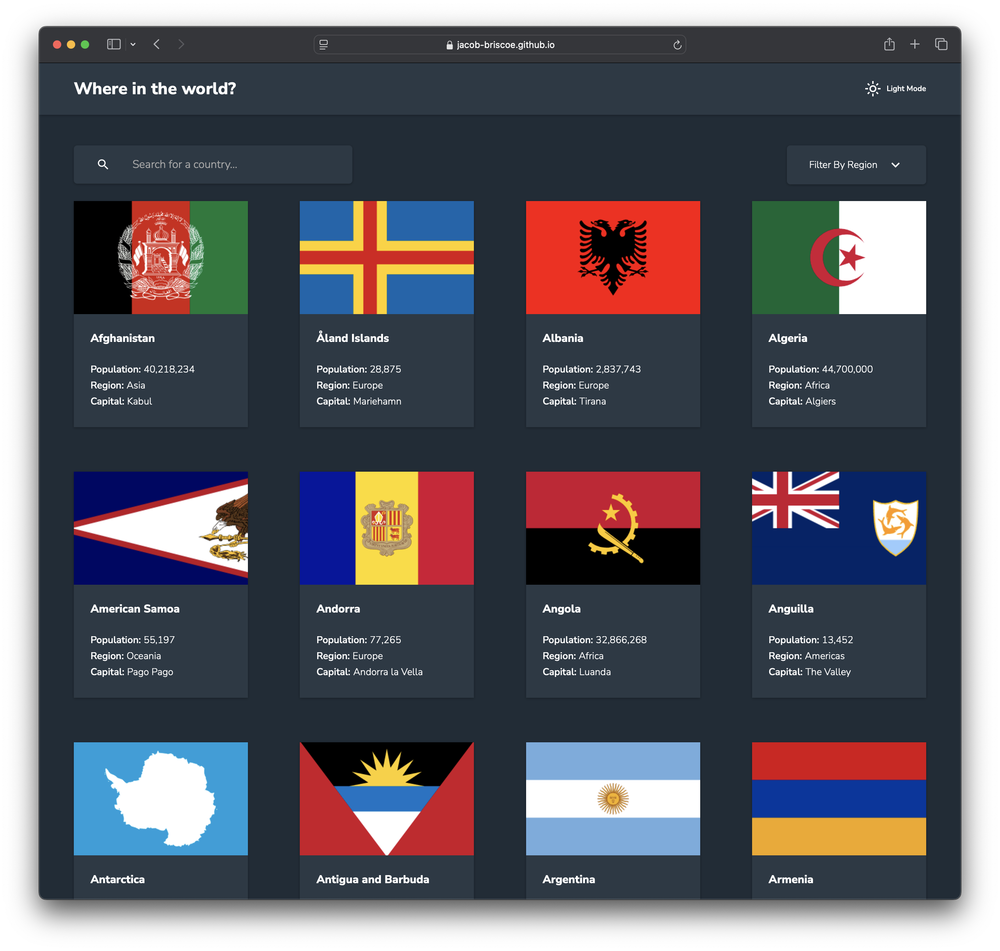
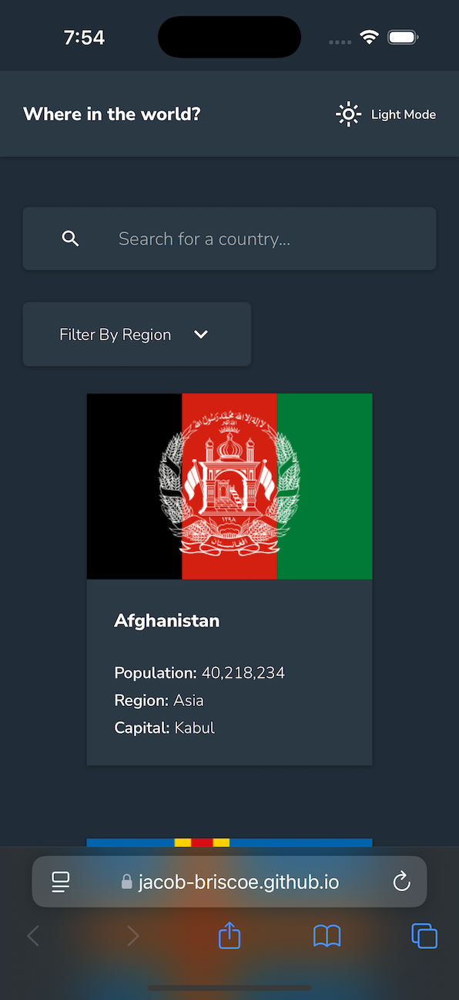

# Frontend Mentor - REST Countries API with color theme switcher solution

This is a solution to the [REST Countries API with color theme switcher challenge on Frontend Mentor](https://www.frontendmentor.io/challenges/rest-countries-api-with-color-theme-switcher-5cacc469fec04111f7b848ca). Frontend Mentor challenges help you improve your coding skills by building realistic projects.

## Table of contents

- [Overview](#overview)
  - [The challenge](#the-challenge)
  - [Screenshot](#screenshot)
  - [Links](#links)
- [My process](#my-process)
  - [Built with](#built-with)
  - [What I learned](#what-i-learned)
  - [Continued development](#continued-development)
  - [Useful resources](#useful-resources)
- [Author](#author)

## Overview

### The challenge

Users should be able to:

- See all countries from the API on the homepage
- Search for a country using an `input` field
- Filter countries by region
- Click on a country to see more detailed information on a separate page
- Click through to the border countries on the detail page
- Toggle the color scheme between light and dark mode _(optional)_

### Screenshot




### Links

- Solution URL: [Add solution URL here](https://your-solution-url.com)
- Live Site URL: [https://jacob-briscoe.github.io/countries-web/](https://jacob-briscoe.github.io/countries-web/)

## My process

### Built with

- Semantic HTML5 markup
- CSS custom properties
- Flexbox
- CSS Grid
- Mobile-first workflow
- [Angular](https://angular.dev/) - JS library

### What I learned

I utilized Angular's built-in view transitions to create a seamless experience when navigating between the homepage and the country detail page. You can see how they are implemented in the code snippet below.

Another nice feature Angular provides is the ability to save the scroll position when navigating between pages. This is especially useful when navigating back to the homepage after viewing a country's details. You can see how this is implemented in the code snippet below.
I utilized hash routing to allow users to share a link to a specific country's details page. This is especially useful when sharing a country with a friend or colleague and it also allows the browser to remember the user's scroll position when navigating back to the homepage.

```ts
provideRouter(
  //...
  withViewTransitions(),
  withInMemoryScrolling({
    anchorScrolling: 'enabled',
    scrollPositionRestoration: 'enabled',
  }),
)

```

### Continued development

I am planning to continue developing this project by adding more features such as:
* map view of the country
* weather information
* currency exchange rates
* aggregate links for example -- if you click a language it will show all countries that speak that language

### Useful resources

- [Angular.dev](https://www.angular.dev) - This is a great site and super helpful for learning Angular.

## Author

- Website - Jacob Briscoe
- Frontend Mentor - [@jacob-briscoe](https://www.frontendmentor.io/profile/jacob-briscoe)
